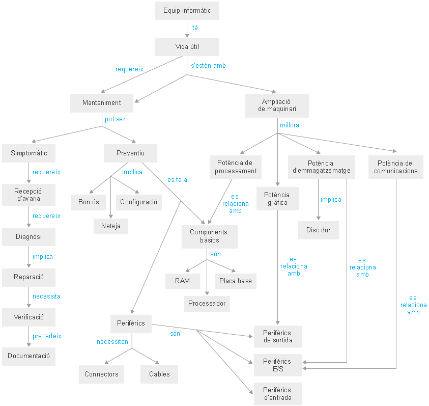

- CE1.1 Identificar las diferentes técnicas de comprobación de funcionalidad de soportes y periféricos, teniendo en cuenta la tecnología de cada uno de ellos.
- CE1.2 Interpretar las guías de instrucciones recibidas referentes a procedimientos de comprobación de funcionalidad de soportes y periféricos para poder comprobar y verificar el buen funcionamiento de los mismos.
- CE1.3 Citar las características de las herramientas utilizadas para comprobar el estado de los soportes y de la información contenida en los mismos, siguiendo guías de uso.
- CE1.4 En un equipo microinformático con unidades lectoras y varios soportes, siguiendo las guías de instrucciones, realizar las siguientes operaciones:
  - Describir las características de los soportes y los riesgos inherentes a cada uno de ellos.
  - Aplicar los procedimientos de comprobación de soportes utilizando herramientas específicas, registrando los resultados y las incidencias producidas.

## Mapa Conceptual



## 1.1 Procés de resolució d'avaries

### Definicions bàsiques
- **Sistema informàtic**: dispositiu capaç d'acceptar dades per entrada, processar-les sota el control d'un programa emmagatzemat en memòria, i retornar informació per sortida.
- **Avaria**: malfuncionament del sistema que ha de ser diagnosticat, reparar i documentat.
- **Diari tècnic**: registre del manteniment del conjunt d'equips de la instal·lació, en què s'apunten les avaries, les solucions i totes les accions modificacions dutes a terme.

### Tipus de fallades
Les avaries poden produir-se per diverses causes:
- Fallades de configuració dels dispositius.
- Fallades del programari.
- Avaries dels dispositius (maquinari).
- Avaries dels sistemes auxiliars (alimentació elèctrica, xarxa, etc.).

### Classificació per gravetat
Les avaries es classifiquen segons tres factors:
1. **Cost del temps d'aturada del sistema**: impacte sobre les operacions.
2. **Temps de reparació**: durada del procés de solució.
3. **Cost de la reparació**: despesa en materials i mà d'obra.

| Nivell de gravetat | Definició | Exemple |
| --- | --- | --- |
| Lleu | Afecta un equip aïllat, poc cost i temps | Avaria de disc dur en estació de treball |
| Greu | Afecta múltiples equips o serveis crítics | Avaria de disc dur en servidor de dades |
| Crítica | Sistema principal inoperant, cost molt alt | Avaria d'alimentació en tota la instal·lació |

---

## 1.1.1 Diagnosi del problema que causa l'avaria

### Preguntes fonamentals per al diagnòstic
Per emetre un diagnòstic correcte, s'ha de respondre a tres preguntes bàsiques:
- **On és l'avaria?** (ubicació del problema)
- **Quina n'és la causa?** (factor root-cause)
- **Quins danys ha provocat?** (impacte i extensió)

### Procés de diagnòstic (6 passos)

1. **Definir el problema i símptomes**: descriure tots els factors que poden produir els símptomes observats.

2. **Recopilar informació**: consultar usuaris afectats, administrador del sistema, utilitzar eines de diagnòstic (benchmark, programari específic).

3. **Confeccionar llista de problemes potencials**: enumerar causes possibles i eliminar les irrellevants.

4. **Establir pla d'accions**: començar pel problema amb més probabilitats de ser la causa.

5. **Executar accions de manera ordenada**: aplicar solucions una a una i observar si desapareixen els símptomes.

6. **Iteració si necessari**: si els símptomes persisteixen, tornar al pas 4 amb el següent problema, o al pas 1 per revisió més exhaustiva.

### Exemple pràctic: Pantalla sense imatge
**Problema**: usuari comunica que la pantalla no mostra imatge.

**Context**: equipament s'engega correctament (sons habituals, indicadors encesos), però es va fer manteniment la nit anterior i neteja de l'oficina.

**Procés de diagnòstic**:
1. Verificar connexió del cable d'alimentació del monitor (solució: cable ben connectat).
2. Comprovar si monitor està apagat (solució: encendre interruptor).
3. Ajustar contrast i lluentor (solució: estaven correctes).
4. Verificar connexió del cable de senyal entre monitor i targeta gràfica (solució: cable desconnectat).
5. Provar monitor en altre equip funcional (solució: monitor funciona en altre equip, descartant avaria del monitor).
6. Revisar targeta gràfica: descobrir que no estava ben inserida al connector, netejar i recollocar.

**Resultado**: problema resolt, documentat en diari tècnic.

---

## 1.1.2 La tècnica de solució de problemes. Diagrames de flux

### El procés d'eliminació
La manera més habitual de posar en pràctica un mètode científic per a solucionar problemes és el **procés d'eliminació**:
- Establir hipòtesis sobre les possibles causes.
- Verificar cada hipòtesi successivament.
- Eliminar les causes que no provoquen els símptomes.
- Continuar fins a identificar la causa real.

**Principi fonamental**: fer canvis d'un en un; si es fan simultàniament, el procés es confós i és difícil identificar la solució exacta.

### Diagrames de flux per a diagnòstic d'avaries
Un **diagrama de flux** és una representació visual d'un algorisme o procés de decisió que:
- Utilitza quadres de diversos tipus (entrada/sortida, decisió, procés).
- Connecta els quadres amb fletxes indicant l'ordre de les accions.
- Documenta el procés de diagnòstic de manera sistemàtica.

**Utilitat**:
- Análisi i documentació de processos de reparació.
- Sistematització de la resolució de problemes.
- Facilita la formació de nous tècnics.
- Permet predir casos no considerats prèviament.

---

## 1.1.3 Manteniment preventiu

### Definició i objectius
**Manteniment preventiu**: tasques de revisió periòdica dels equips per detectar indicis de possibles fallades i prendre mesures per evitar-les o minimitzar-ne els efectes.

### Factors que afecten la vida útil de l'ordinador

#### Pols i brutícia
- Les ventiladores extreu aire calent del sisconsistema i introdueix aire fresc, portant **pols** i **partícules** (nicotina, pluïja).
- Acumulació de pols als capçals de lectura-escriptura de dispositius magnètics.
- **Acció preventiva**: evitar ambients polvosos, netejar ventiladores i filters regularment.

#### Humitat
- Humitat excessiva crea una capa aïllant sobre els components.
- Acumulació de calor en els components.
- **Acció preventiva**: mantenir humitat relativa entre 30% i 70%, evitar condensació.

#### Temperatura
- **Rang òptim**: 18 °C a 23 °C.
- **Riscos**: canvis sobtats de temperatura causen expansió/contracció de components.
- **Efecte en suports de dades**: errors de lectura-escriptura.
- **Acció preventiva**: mantenir temperatura constant, evitar exposició a sol directe.

#### Camps magnètics
- Altres aparells electrònics (impressores làser, fonts d'alimentació) produeixen forts camps que causen **interferències**.
- Afecta especialment disquets i cablejat no protegit.
- **Acció preventiva**: separar equips de possibles fonts de camp magnètic, protegir cablejat.

| Factor ambient | Efecte negatiu | Mesura preventiva |
| --- | --- | --- |
| Pols i brutícia | Obstrucció ventilació, corrosió | Netejar filters i ventiladores cada 3–6 mesos |
| Humitat alta | Oxidació, aïllament tèrmic | Mantenir 30–70% humitat relativa |
| Temperatura extrema | Danys semiconductors, errors E/S | Mantenir 18–23 °C constant |
| Camps magnètics | Interferència electromagnètica | Separar de sources de camp magnètic |

### Certificacions ecològiques i energètiques
- **TCO (Total Cost of Ownership)**: certificació de qualitat ambiental (emissions electromagnètiques).
- **Energy Star**: certificació d'eficiència energètica (consum de potència).
- **Etiquet ecològica de la UE**: garantia de menor impacte ambiental al llarg del cicle de vida.

### Passos bàsics del manteniment preventiu

1. **Inspecció general**: revisar estat general del sistema i perifèrics.
2. **Inspecció interna**: netejar components interns, verificar connexions, revisar sistemes de refrigeració.
3. **Execució de benchmarks**: executar programes de diagnòstic i comparar amb registres anteriors.
4. **Valoració de resultats**: decidir continuïtat, reparació o substitució.
5. **Documentació**: anotar resultats i decisions en el registre del maquinari i diari tècnic.

### Sistemes d'alimentació ininterrompuda (SAI)
Un **SAI (Uninterruptible Power Supply)** és un dispositiu de manteniment preventiu que:
- Proporciona energia elèctrica des de bateries en cas de caiguda de l'alimentació.
- Millora la qualitat de l'energia: filtra pujades/baixades de tensió.
- Elimina harmònics en el corrent altern.
- **Utilitat**: evita pèrdua de dades i danys en components per fluctuacions elèctriques.

---

## Exercicis proposats

### Exercici 1: Classificació de gravetat
Classifica les següents avaries per gravetat (lleu, greu, crítica) i justifica:
1. Avaria de monitor en una estació de treball.
2. Avaria del servidor de base de dades en una empresa de 100 empleats.
3. Fallada d'alimentació elèctrica en tot l'edifici.
4. Avaria de teclat en una estació de treball.

### Exercici 2: Procés de diagnòstic
A partir del problema "l'ordinador no s'engega", elabora els 6 passos del diagnòstic:
1. Defineix el problema i símptomes potencials.
2. Llista de 5 causes possibles.
3. Planteja un pla d'accions ordenat.

### Exercici 3: Diagrama de flux simple
Crea un diagrama de flux (en format text o descripcio) per diagnosticar "l'impresora no imprimeix".
Inclou almanco 5 decisions/accions.

### Exercici 4: Manteniment preventiu
Planifica un calendari de manteniment preventiu per a 10 ordinadors en una oficina:
- Accions mensuals.
- Accions trimestrals.
- Accions anuals.

---

## Solucions breus

### Solució 1: Classificació de gravetat
1. **Monitor en estació de treball**: Lleu. Afecta un usuari, temps baix de reparació, cost reduït.
2. **Servidor de BD (100 empleats)**: Crítica. Afecta tota l'empresa, cost alt de temps d'inactivitat, possibilitat de pèrdua de dades.
3. **Fallada elèctrica edifici**: Crítica. Afecta tots els sistemes, risc de danys a components, inactivitat completa.
4. **Teclat**: Lleu. Solució ràpida (substitució), un usuari afectat.

### Solució 2: Procés de diagnòstic
1. **Símptomes**: ordinador no s'engega, no hi ha llum ni sons, botó d'engegada no respon.
2. **Causes possibles**: (a) cable alimentació desconnectat, (b) font alimentació fallada, (c) placa base defectuosa, (d) botó d'engegada malmès, (e) bateria CMOS descarregada.
3. **Pla d'accions**: 
   - Verificar connexió cable alimentació.
   - Provar amb altra font alimentació.
   - Revisar connexió cable a placa base.
   - Provar botó d'engegada amb multímetre.
   - Comprovar bateria CMOS i reemplaçar si necessari.

### Solució 3: Diagrama de flux — Impresora no imprimeix
```
INICI: Impresora no imprimeix
  ↓
¿Impresora encesa? → NO → Encendre i provar
  ↓ SÍ
¿Cable USB conectat? → NO → Conectar cable
  ↓ SÍ
¿Hi ha paper? → NO → Afegir paper
  ↓ SÍ
¿Cua d'impressió buit? → NO → Netejar cua (software)
  ↓ SÍ
¿Driver instal·lat? → NO → Instal·lar driver
  ↓ SÍ
Problema de maquinari → Reparació tècnica
```

### Solució 4: Calendari de manteniment preventiu (10 ordinadors)
| Freqüència | Accions |
| --- | --- |
| Mensual | Netejar exterior, revisar temperatura, executa antivirus |
| Trimestral | Netejar ventiladores, revisar connections, executar benchmark |
| Anual | Desmuntatge complet, netejar interior, revisar capacitors, actualitzar firmware |

---

## Glossari de termes clau

- **Avaria**: malfuncionament del sistema que requereix diagnòstic i reparació.
- **Benchmark**: programa de diagnòstic que mesura rendiment del sistema.
- **Diari tècnic**: registre de manteniment, avaries i solucions de la instal·lació.
- **Diagnòstic**: procés de identificació de la causa d'una avaria.
- **DMA (Accés directe a memòria)**: transferència de dades sense participació de la CPU.
- **Manteniment preventiu**: tasques periòdiques per evitar avaries.
- **Manteniment correctiu**: reparació d'avaries sorgides.
- **SAI (Sistema d'alimentació ininterrompuda)**: dispositiu que proporciona energia en cas de fallada elèctrica.
- **TCO**: certificació de qualitat ambiental i energètica.
